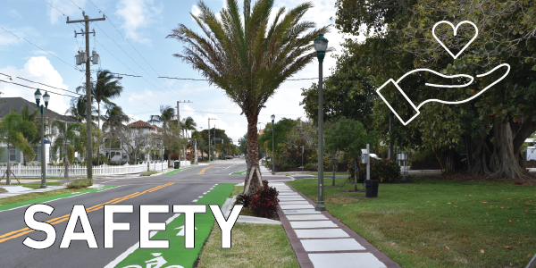
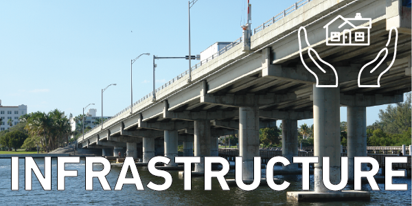
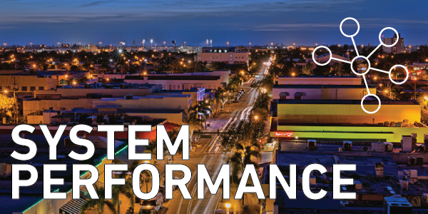
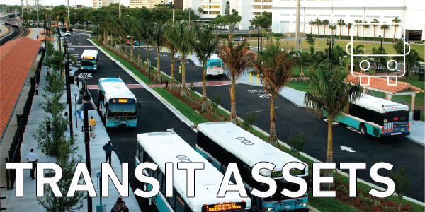
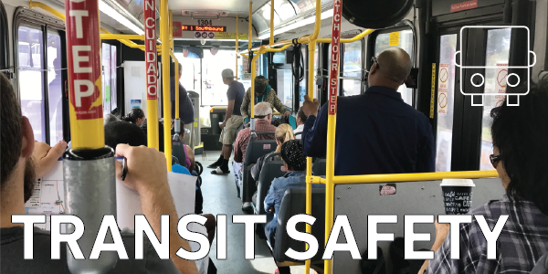

::: {.text-left}

{width="100%"}
<button onclick="window.print()" class="print-button">
  Print / Save as PDF
</button>

The following goals, objectives, performance measures and targets are associated with the MPO’s Vision of a safe, efficient, and connected multimodal transportation system. The performance measures and targets are adopted into the MPO's 2050 Long Range Transportation Plan (LRTP) and integrated into the the MPO's 5-Year Transportation Improvement Program (TIP). 

This interactive dashboard provides a way to view the most up-to-date information for all performance measures adopted by the MPO. Formal review, public involvement, and the update of targets occurs annually in February.
:::
# Palm Beach MPO Federal Performance Measures Scorecard

## Test Consolidated Scorecard

```{r, echo=FALSE, warning=FALSE, message=FALSE}
library(readxl)
library(dplyr)
library(gt)

scorecard <- read_excel(
  "C:/MPO/OneDrive - Palm Beach MPO/Documents/Performance_Measures/Performance_Measures_R.xlsx",
  sheet = "Scorecard_All"
)

scorecard <- scorecard |>
  mutate(
    Goal_Met_Display = case_when(
      Goal_Met == "Yes" ~ "✓",
      Goal_Met == "No" ~ "✕",
      Goal_Met == "New" ~ "New",
      TRUE ~ ""
    ),

    Format_Group = case_when(
      Metric %in% c(
        "SAFETY (5 -YR Avg.)",
        "Fatalities",
        "Fatal Crash Rate",
        "Serious Injuries",
        "Serious Injury Rate",
        "Non-motorized Fatalities and Serious Injuries",
        "TRANSIT SAFETY: PALM TRAN",
        "Fixed Route Bus",
        "Paratransit (Palm Tran Connection)",
        "Fatality Rate (per 100k VRM)",
        "Injuries",
        "Injury Rate (per 100k VRM)",
        "Safety Events",
        "Safety Event Rate (per 100k VRM)",
        "System Reliability (VRM/failures)"
      ) ~ "number",

      Metric == "Truck Travel Time Reliability on the Interstate" ~ "number",

      Metric %in% c(
        "INFRASTRUCTURE",
        "Bridges",
        "Pavement",
        "SYSTEM PERFORAMANCE RELIABILITY",
        "TRANSIT ASSET MANAGEMENT",
        "Palm Tran",
        "Tri-Rail"
      ) ~ "header",

      TRUE ~ "percent"
    )
  )

scorecard |>
  select(
    Metric,
    Goal_Met_Display,
    `Actual (2024)`,
    `Target (2025)`,
    Format_Group
  ) |>
  gt() |>
  fmt_number(
    columns = `Actual (2024)`,
    rows = Format_Group == "number",
    decimals = 2,
    drop_trailing_zeros = TRUE
  ) |>
  fmt_percent(
    columns = `Actual (2024)`,
    rows = Format_Group == "percent",
    decimals = 0
  ) |>
  cols_hide(
    columns = Format_Group
  ) |>
  cols_label(
    Metric = "Metric",
    Goal_Met_Display = "Goal Met",
    `Actual (2024)` = "Actual (2024)",
    `Target (2025)` = "Target (2025)"
  ) |>
  sub_missing(
    columns = everything(),
    missing_text = ""
  ) |>
  tab_style(
    style = list(
      cell_fill(color = "#62B5E5"),
      cell_text(color = "white", weight = "bold", size = px(18))
    ),
    locations = cells_column_labels(everything())
  ) |>
  tab_style(
    style = cell_text(weight = "bold", size = px(20), color = "#646566"),
    locations = cells_body(
      columns = Metric,
      rows = Metric %in% c(
        "SAFETY (5 -YR Avg.)",
        "INFRASTRUCTURE",
        "SYSTEM PERFORAMANCE RELIABILITY",
        "TRANSIT ASSET MANAGEMENT",
        "TRANSIT SAFETY: PALM TRAN"
      )
    )
  ) |>
  tab_style(
    style = cell_text(weight = "bold", size = px(18), color = "#646566"),
    locations = cells_body(
      columns = Metric,
      rows = Metric %in% c(
        "Bridges",
        "Pavement",
        "Palm Tran",
        "Tri-Rail",
        "Fixed Route Bus",
        "Paratransit (Palm Tran Connection)"
      )
    )
  ) |>
  cols_align(
    align = "center",
    columns = c(Goal_Met_Display, `Actual (2024)`, `Target (2025)`)
  ) |>
  cols_width(
    Metric ~ px(430),
    Goal_Met_Display ~ px(100),
    `Actual (2024)` ~ px(140),
    `Target (2025)` ~ px(140)
  ) |>
  tab_style(
    style = cell_text(color = "#F8485E", weight = "bold", size = px(30)),
    locations = cells_body(
      columns = Goal_Met_Display,
      rows = Goal_Met_Display == "✕"
    )
  ) |>
  tab_style(
    style = cell_text(color = "#26D07C", weight = "bold", size = px(30)),
    locations = cells_body(
      columns = Goal_Met_Display,
      rows = Goal_Met_Display == "✓"
    )
  ) |>
  tab_style(
    style = cell_text(color = "#646566", weight = "bold", size = px(16)),
    locations = cells_body(
      columns = Goal_Met_Display,
      rows = Goal_Met_Display == "New"
    )
  ) |>
  opt_row_striping() |>
  tab_options(
    table.width = pct(100),
    table.font.size = px(16),
    data_row.padding = px(4),
    column_labels.border.bottom.color = "#D9E2EC",
    table.border.top.color = "white",
    table.border.bottom.color = "white",
    row.striping.background_color = "#F7F9FC",
    heading.background.color = "white",
    table_body.hlines.color = "#E6ECF2",
    table_body.vlines.color = "white"
  )
```
## Safety
:::{.text-left}
{width="%"} 

**Safety** Performance measures track the 
number of facilities and serious injuries, 
as well as non-motorized fatalities 
and serious injuries over a 5-year moving period.
:::

```{r, echo=FALSE, warning=FALSE, message=FALSE}
library(readxl)
library(dplyr)
library(gt)

scorecard <- read_excel(
  "C:/MPO/OneDrive - Palm Beach MPO/Documents/Performance_Measures/Performance_Measures_R.xlsx",
  sheet = "Scorecard_Safety"
)

scorecard |>
  mutate(
    Goal_Met = ifelse(Goal_Met == "Yes", "✓", "✕")
  ) |>
  gt() |>
  cols_label(
    Metric = "Metric",
    Goal_Met = "Goal Met",
    Five_Year_Avg = "5-YR Avg. 2024",
    Target = "Target"
  ) |>
  tab_style(
    style = list(
      cell_fill(color = "#62B5E5"),
      cell_text(color = "white", weight = "bold", size = px(18))
    ),
    locations = cells_column_labels(everything())
  ) |>
  tab_style(
    style = cell_text(weight = "bold", size = px(18), color = "#646566"),
    locations = cells_body(columns = Metric)
  ) |>
  cols_align(
    align = "center",
    columns = c(Goal_Met, Five_Year_Avg, Target)
  ) |>
  tab_style(
    style = cell_text(color = "red", weight = "bold", size = px(30)),
    locations = cells_body(
      columns = Goal_Met,
      rows = Goal_Met == "✕"
    )
  ) |>
  cols_width(
  Metric ~ px(350),
  Goal_Met ~ px(100),
  Five_Year_Avg ~ px(120),
  Target ~ px(100)
) |>
  opt_row_striping() |>
  tab_options(
    table.width = pct(100),
    table.font.size = px(16),
    data_row.padding = px(4),
    column_labels.border.bottom.color = "#D9E2EC",
    table.border.top.color = "white",
    table.border.bottom.color = "white",
    row.striping.background_color = "#F7F9FC",
    heading.background.color = "white",
    table_body.hlines.color = "#E6ECF2",
    table_body.vlines.color = "white"
  )
```
## Infrastructure Conditions
:::{.text-left}
{width="%"} 

**Infrastructure Conditions** Performance measures track the conditions of bridges and pavement on the National Highway System (NHS) both for Interstate and Non-Interstate routes.
:::

```{r, echo=FALSE, warning=FALSE, message=FALSE}
library(readxl)
library(dplyr)
library(gt)

scorecard <- read_excel(
  "C:/MPO/OneDrive - Palm Beach MPO/Documents/Performance_Measures/Performance_Measures_R.xlsx",
  sheet = "Scorecard_Infrastructure"
)

scorecard |>
  mutate(
    Goal_Met = ifelse(Goal_Met == "Yes", "✓", "✕")
  ) |>
  gt() |>
  fmt_percent(
    columns = c(`Actual (2024)`, `Target (2025)`),
    decimals = 0
  ) |>
  cols_label(
    Metric = "Metric",
    Goal_Met = "Goal Met",
    `Actual (2024)` = "Actual (2024)",
    `Target (2025)` = "Target (2025)"
  ) |>
  sub_missing(
    columns = everything(),
    missing_text = ""
  ) |>
  tab_style(
    style = list(
      cell_fill(color = "#62B5E5"),
      cell_text(color = "white", weight = "bold", size = px(18))
    ),
    locations = cells_column_labels(everything())
  ) |>
  tab_style(
  style = cell_text(weight = "bold", size = px(18), color = "#646566"),
  locations = cells_body(
    columns = Metric,
    rows = Metric %in% c("Bridges", "Pavement")
  )
) |>
  cols_align(
    align = "center",
    columns = c(Goal_Met, `Actual (2024)`, `Target (2025)`)
  ) |>
  tab_style(
    style = cell_text(color = "#F8485E", weight = "bold", size = px(30)),
    locations = cells_body(
      columns = Goal_Met,
      rows = Goal_Met == "✕"
    )
  ) |>
  tab_style(
    style = cell_text(color = "#26D07C", weight = "bold", size = px(30)),
    locations = cells_body(
      columns = Goal_Met,
      rows = Goal_Met == "✓"
    )
  ) |>
  cols_width(
  Metric ~ px(350),
  Goal_Met ~ px(100),
  `Actual (2024)` ~ px(120),
  `Target (2025)` ~ px(120)
) |>
  opt_row_striping() |>
  tab_options(
    table.width = pct(100),
    table.font.size = px(16),
    data_row.padding = px(4),
    column_labels.border.bottom.color = "#D9E2EC",
    table.border.top.color = "white",
    table.border.bottom.color = "white",
    row.striping.background_color = "#F7F9FC",
    heading.background.color = "white",
    table_body.hlines.color = "#E6ECF2",
    table_body.vlines.color = "white"
  )
```
## System Performance Reliability
:::{.text-left}
{width="%"} 

**System Performance Reliability** measures the consistency of traffic flow.
:::
```{r, echo=FALSE, warning=FALSE, message=FALSE}
library(readxl)
library(dplyr)
library(gt)

scorecard <- read_excel(
  "C:/MPO/OneDrive - Palm Beach MPO/Documents/Performance_Measures/Performance_Measures_R.xlsx",
  sheet = "Scorecard_Sys_Per_Reli"
)

scorecard |>
  mutate(
    Goal_Met = ifelse(Goal_Met == "Yes", "✓", "✕")
  ) |>
  gt() |>
tab_style(
  style = cell_text(),
  locations = cells_body(
    columns = `Actual (2024)`,
    rows = 1:2
  )
) |>
fmt(
  columns = `Actual (2024)`,
  rows = 1:2,
  fns = function(x) paste0(round(x * 100, 1), "%")
) |>
  cols_label(
    Metric = "Metric",
    Goal_Met = "Goal Met",
    `Actual (2024)` = "Actual (2024)",
    `Target (2025)` = "Target (2025)"
  ) |>
  tab_style(
    style = list(
      cell_fill(color = "#62B5E5"),
      cell_text(color = "white", weight = "bold", size = px(18))
    ),
    locations = cells_column_labels(everything())
  ) |>
  tab_style(
    style = cell_text(weight = "bold", size = px(18), color = "#646566"),
    locations = cells_body(columns = Metric)
  ) |>
  cols_align(
    align = "center",
    columns = c(Goal_Met, `Actual (2024)`, `Target (2025)`)
  ) |>
  tab_style(
    style = cell_text(color = "#F8485E", weight = "bold", size = px(30)),
    locations = cells_body(
      columns = Goal_Met,
      rows = Goal_Met == "✕"
    )
  ) |>
  tab_style(
    style = cell_text(color = "#26D07C", weight = "bold", size = px(30)),
    locations = cells_body(
      columns = Goal_Met,
      rows = Goal_Met == "✓"
    )
  ) |>
  opt_row_striping() |>
  tab_options(
    table.width = pct(100),
    table.font.size = px(16),
    data_row.padding = px(4),
    column_labels.border.bottom.color = "#D9E2EC",
    table.border.top.color = "white",
    table.border.bottom.color = "white",
    row.striping.background_color = "#F7F9FC",
    heading.background.color = "white",
    table_body.hlines.color = "#E6ECF2",
    table_body.vlines.color = "white"
  )
```
## Transit Asset Management
:::{.text-left}
{width="%"} 

**Transit agencies** are responsible for maintaining vehicles, buildings, track, and other assets to ensure quality and reliable service. These metrics track the condition and age of such assets.
:::

```{r, echo=FALSE, warning=FALSE, message=FALSE}
library(readxl)
library(dplyr)
library(gt)

scorecard <- read_excel(
  "C:/MPO/OneDrive - Palm Beach MPO/Documents/Performance_Measures/Performance_Measures_R.xlsx",
  sheet = "Scorecard_Transit_As_Man"
)

if ("Goal Met" %in% names(scorecard)) {
  scorecard <- scorecard |>
    rename(Goal_Met = `Goal Met`)
}

scorecard |>
  mutate(
    Goal_Met = ifelse(Goal_Met == "Yes", "✓", "✕")
  ) |>
  gt() |>
  fmt_percent(
    columns = `Actual (2023)`,
    decimals = 2
  ) |>
  cols_label(
    Metric = "Metric",
    Goal_Met = "Goal Met",
    `Actual (2023)` = "Actual (2023)",
    `Target (2024)` = "Target (2024)"
  ) |>
  sub_missing(
    columns = everything(),
    missing_text = ""
  ) |>
  tab_style(
    style = list(
      cell_fill(color = "#62B5E5"),
      cell_text(color = "white", weight = "bold", size = px(18))
    ),
    locations = cells_column_labels(everything())
  ) |>
  tab_style(
    style = cell_text(weight = "bold", size = px(20), color = "#646566"),
    locations = cells_body(
      columns = Metric,
      rows = Metric %in% c("Palm Tran", "Tri-Rail")
    )
  ) |>
  cols_align(
    align = "center",
    columns = c(Goal_Met, `Actual (2023)`, `Target (2024)`)
  ) |>
  cols_width(
    Metric ~ px(360),
    Goal_Met ~ px(100),
    `Actual (2023)` ~ px(130),
    `Target (2024)` ~ px(130)
  ) |>
  tab_style(
    style = cell_text(color = "#F8485E", weight = "bold", size = px(30)),
    locations = cells_body(
      columns = Goal_Met,
      rows = Goal_Met == "✕"
    )
  ) |>
  tab_style(
    style = cell_text(color = "#26D07C", weight = "bold", size = px(30)),
    locations = cells_body(
      columns = Goal_Met,
      rows = Goal_Met == "✓"
    )
  ) |>
  opt_row_striping() |>
  tab_options(
    table.width = pct(100),
    table.font.size = px(16),
    data_row.padding = px(4),
    column_labels.border.bottom.color = "#D9E2EC",
    table.border.top.color = "white",
    table.border.bottom.color = "white",
    row.striping.background_color = "#F7F9FC",
    heading.background.color = "white",
    table_body.hlines.color = "#E6ECF2",
    table_body.vlines.color = "white"
  )
```

## Transit Safety: Palm Tran
:::{.text-left}
{width="%"} 

Transit providers must annually establish **transit safety** performance targets. MPOs also must establish transit safety targets and incorporate transit safety in the metropolitan transportation planning process.
:::

```{r, echo=FALSE, warning=FALSE, message=FALSE}
library(readxl)
library(dplyr)
library(gt)

scorecard <- read_excel(
  "C:/MPO/OneDrive - Palm Beach MPO/Documents/Performance_Measures/Performance_Measures_R.xlsx",
  sheet = "Scorecard_Transit_Safety"
)

scorecard |>
  gt() |>
  fmt_number(
    columns = c(`Actual (2024)`, `Target (2025)`),
    decimals = 1,
    drop_trailing_zeros = TRUE
  ) |>
  cols_label(
    Metric = "Metric",
    `Goal Met` = "Goal Met",
    `Actual (2024)` = "Actual (2024)",
    `Target (2025)` = "Target (2025)"
  ) |>
  sub_missing(
    columns = everything(),
    missing_text = ""
  ) |>
  tab_style(
    style = list(
      cell_fill(color = "#62B5E5"),
      cell_text(color = "white", weight = "bold", size = px(18))
    ),
    locations = cells_column_labels(everything())
  ) |>
  tab_style(
    style = cell_text(weight = "bold", size = px(20), color = "#646566"),
    locations = cells_body(
      columns = Metric,
      rows = Metric %in% c("Fixed Route Bus", "Paratransit (Palm Tran Connection)")
    )
  ) |>
  cols_align(
    align = "center",
    columns = c(`Goal Met`, `Actual (2024)`, `Target (2025)`)
  ) |>
  cols_width(
    Metric ~ px(360),
    `Goal Met` ~ px(100),
    `Actual (2024)` ~ px(130),
    `Target (2025)` ~ px(130)
  ) |>
  opt_row_striping() |>
  tab_options(
    table.width = pct(100),
    table.font.size = px(16),
    data_row.padding = px(4),
    column_labels.border.bottom.color = "#D9E2EC",
    table.border.top.color = "white",
    table.border.bottom.color = "white",
    row.striping.background_color = "#F7F9FC",
    heading.background.color = "white",
    table_body.hlines.color = "#E6ECF2",
    table_body.vlines.color = "white"
  )
```
:::{.text-left}
Source: Palm Tran Public Transportation Agency Safety Plan
:::
# 1) Safety
:::{.text-left}
The Palm Beach MPO and the State of Florida have set a goal for **zero** fatalities and serious injuries on the roadway network. Florida and Metropolitan Planning Organizations (MPOs), are federally required to track and set targets for **total fatalities, fatality rate, serious injuries, serious injury rate**, and the total number of **non-motorized (pedestrian & bicyclists) fatalities and serious injuries**. For more information, [see FDOT's guidance document](https://fdotwww.blob.core.windows.net/sitefinity/docs/default-source/planning/fto/pdis-documents/performance-measures-methodology-and-data-report.pdf?sfvrsn=72082866_1).
:::
::: {.panel-tabset .nav-pills}
## Fatalities 

```{r, echo=FALSE}
library(highcharter)

roadway_fatalities <- data.frame(
  Year = c(2018, 2019, 2020, 2021, 2022, 2023, 2024),
  Number = c(183, 174, 185, 215, 226, 181, 210)
)

highchart() |>
  hc_chart(
  type = "column",
  backgroundColor = "white"
) |>
  hc_title(text = "Roadway Fatalities by Year (5-YR Avg.)") |>
  hc_subtitle(text = "Palm Beach County") |>
  hc_xAxis(
    categories = as.character(roadway_fatalities$Year),
    title = list(text = "Year")
  ) |>
  hc_yAxis(
    title = list(text = "Number of Fatalities"),
    min = 0,
    max = 250
  ) |>
  hc_add_series(
    name = "Fatalities",
    data = roadway_fatalities$Number,
    color = "#147BD1"
  ) |>
  hc_add_series(
    name = "Target",
    data = rep(0, nrow(roadway_fatalities)),
    type = "line",
    dashStyle = "Dash",
    color = "#000000",
    marker = list(enabled = FALSE)
  ) |>
hc_tooltip(
  pointFormat = "<b>{point.y}</b>"
) |>
hc_exporting(
  enabled = TRUE
)
```
:::{.text-left}
Source: FDOT Source Book Number and Rate of Fatalities.
:::

## Fatal Crash Rate

```{r, echo=FALSE}
library(highcharter)

fatal_rate <- data.frame(
  Year = c(2018, 2019, 2020, 2021, 2022, 2023, 2024),
  Rate = c(1.29, 1.21, 1.4, 1.56, 1.63, 1.22, 1.38)
)

highchart() |>
  hc_chart(
  type = "line",
  backgroundColor = "white"
) |>
  hc_title(text = "Fatal Crash Rate") |>
  hc_subtitle(text = "Palm Beach County") |>
  hc_xAxis(categories = fatal_rate$Year) |>
  hc_yAxis(
    title = list(text = "Rate per 100M VMT")
  ) |>
  hc_add_series(
    name = "Fatal Crash Rate",
    data = fatal_rate$Rate,
    color = "#147BD1"
  ) |>
  hc_plotOptions(
    line = list(
      marker = list(enabled = TRUE)
    )
  ) |>
  hc_exporting(
    enabled = TRUE
  )
```
:::{.text-left}
Source: FDOT Source Book Number and Rate of Fatalities.
:::
## Serious Injuries

```{r, echo=FALSE}
library(highcharter)

serious_injuries <- data.frame(
  Year = c(2018, 2019, 2020, 2021, 2022, 2023, 2024),
  Number = c(1194, 1020, 916, 890, 818, 766, 683)
)

highchart() |>
  hc_chart(
  type = "column",
  backgroundColor = "white"
) |>
  hc_title(text = "Serious Injuries by Year") |>
  hc_subtitle(text = "Palm Beach County") |>
  hc_xAxis(
    categories = as.character(serious_injuries$Year),
    title = list(text = "Year")
  ) |>
  hc_yAxis(
    title = list(text = "Number of Serious Injuries"),
    min = 0
  ) |>
  hc_add_series(
    name = "Serious Injuries",
    data = serious_injuries$Number,
    color = "#147BD1"
  ) |>
  hc_add_series(
    name = "Target",
    data = rep(0, nrow(serious_injuries)),
    type = "line",
    dashStyle = "Dash",
    color = "#000000",
    marker = list(enabled = FALSE)
  ) |>
hc_tooltip(
  pointFormat = "<b>{point.y}</b>"
) |>
hc_exporting(
  enabled = TRUE
)
```
:::{.text-left}
Source: Signal Four Analytics Florida Traffic Safety Dashboard for Palm Beach County.
:::
## Serious Injury Rate

```{r, echo=FALSE}
library(highcharter)

serious_rate <- data.frame(
  Year = c(2018, 2019, 2020, 2021, 2022, 2023, 2024),
  Rate = c(8.42, 7.08, 6.91, 6.45, 5.73, 5.16, NA)
)

highchart() |>
  hc_chart(
  type = "line",
  backgroundColor = "white"
) |>
  hc_title(text = "Serious Injury Rate") |>
  hc_subtitle(text = "Palm Beach County") |>
  
  hc_xAxis(categories = serious_rate$Year) |>
  
  hc_yAxis(
    title = list(text = "Rate per 100M VMT")
  ) |>
  
  hc_add_series(
    name = "Serious Injury Rate",
    data = serious_rate$Rate,
    color = "#147BD1"
  ) |>
  
  hc_plotOptions(
    line = list(
      marker = list(enabled = TRUE)
    )
  ) |>
  
  hc_exporting(
    enabled = TRUE
  )
```
:::{.text-left}
Source: FDOT Source Book Federal Performance Measures.
:::
## Nonmotorized Fatalities and Serious Injuries

```{r, echo=FALSE}
library(highcharter)

nonmotorized <- data.frame(
  Year = c(2016, 2017, 2018, 2019, 2020, 2021, 2022, 2023, 2024),
  Number = c(196, 209, 214, 217, 198, 190, 201, 199, 241)
)

highchart() |>
  hc_chart(
  type = "column",
  backgroundColor = "white"
) |>
  
  hc_title(text = "Nonmotorized Fatalities and Serious Injuries") |>
  
  hc_subtitle(text = "Palm Beach County") |>
  
  hc_xAxis(
    categories = as.character(nonmotorized$Year),
    title = list(text = "Year")
  ) |>
  
  hc_yAxis(
    title = list(text = "Number of Fatalities and Serious Injuries"),
    min = 0,
    max = 250
  ) |>
  
  hc_add_series(
    name = "Fatalities & Serious Injuries",
    data = nonmotorized$Number,
    color = "#147BD1"
  ) |>
  
  hc_add_series(
    name = "Target",
    data = rep(0, 9),
    type = "line",
    dashStyle = "Dash",
    color = "#000000",
    marker = list(enabled = FALSE)
  ) |>
hc_tooltip(
  pointFormat = "<b>{point.y}</b>"
) |>
hc_exporting(
  enabled = TRUE
)
```
:::{.text-left}
Source: FDOT State Safety Office Crash Analysis Reporting (CAR) database.
:::
:::
# 2) Infrastructure Conditions
## Bridge Conditions
:::{.text-left}
**Bridge condition** is required to be tracked for all bridges on the National Highway System (NHS). Good condition suggests no major investment is needed, while Poor condition suggests major reconstruction investment is needed.

Bridge structures over 20 feet are inspected every 2 years and rated on a scale of 1 to 9. To receive a "Good" assessment, each element of the bridge must be rated 7 or higher. Bridge elements include the deck, substructure, superstructure, culverts and retaining walls. Structures with any of these element with a rating of 4 or lower is considered "Poor".
:::
::: {.panel-tabset .nav-pills}
## Bridges in Good Condition

```{r, echo=FALSE}
library(highcharter)

good_condition <- data.frame(
  Year = c(2017, 2018, 2019, 2020, 2021, 2022, 2023, 2024),
  Value = c(0.877, 0.874, 0.852, 0.822, 0.821, 0.817, 0.842, 0.832)
)

highchart() |>
  hc_chart(
  type = "line",
  backgroundColor = "white"
) |>
  hc_title(text = "Bridges in Good Condition") |>
  hc_subtitle(text = "Palm Beach County") |>
  hc_xAxis(categories = good_condition$Year) |>
  hc_yAxis(
    title = list(text = "Percent of Bridges"),
    min = 0.4,
    max = 1,
    tickInterval = 0.1,
    labels = list(
      formatter = JS("function() {
        return (this.value * 100).toFixed(0) + '%';
      }")
    )
  ) |>
  hc_add_series(
    name = "Good Condition",
    data = good_condition$Value,
    color = "#26D07C"
  ) |>
  hc_add_series(
    name = "Target",
    data = rep(0.50, 8),
    dashStyle = "Dash",
    color = "#000000"
  ) |>
  hc_tooltip(
    formatter = JS(
      "function() {
        return '<b>' + (this.y * 100).toFixed(1) + '%</b>';
      }"
    )
  ) |>
  hc_plotOptions(
    line = list(marker = list(enabled = TRUE))
  ) |>
  hc_exporting(
    enabled = TRUE
  )
```
:::{.text-left}
Source: FDOT Source Book Federal Performance Measures.
:::
## Bridges in Poor Condition

```{r, echo=FALSE}
library(highcharter)

poor_condition <- data.frame(
  Year = c(2017, 2018, 2019, 2020, 2021, 2022, 2023, 2024),
  Value = c(0.012, 0.010, 0.010, 0.010, 0.010, 0.022, 0.000, 0.000)
)

highchart() |>
  hc_chart(
  type = "line",
  backgroundColor = "white"
) |>
  hc_title(text = "Bridges in Poor Condition") |>
  hc_subtitle(text = "Palm Beach County") |>
  hc_xAxis(categories = poor_condition$Year) |>
  hc_yAxis(
    title = list(text = "Percent of Bridges"),
    min = 0,
    max = 0.06,
    tickInterval = 0.01,
    labels = list(
      formatter = JS("function() {
        return (this.value * 100).toFixed(0) + '%';
      }")
    )
  ) |>
  hc_add_series(
    name = "Poor Condition",
    data = poor_condition$Value,
    color = "#F8485E"
  ) |>
  hc_add_series(
    name = "Target",
    data = rep(0.05, 8),
    dashStyle = "Dash",
    color = "#000000"
  ) |>
  hc_tooltip(
    formatter = JS(
      "function() {
        return '<b>' + (this.y * 100).toFixed(1) + '%</b>';
      }"
    )
  ) |>
  hc_plotOptions(
    line = list(marker = list(enabled = TRUE))
  ) |>
  hc_exporting(
    enabled = TRUE
  )
```
:::{.text-left}
Source: FDOT Source Book Federal Performance Measures.
:::
:::
::: {.panel-tabset .nav-pills}
## Map of All Bridges

```{r, echo=FALSE, warning=FALSE, message=FALSE}
library(leaflet)
library(htmltools)

bridges <- read.csv("C:/MPO/OneDrive - Palm Beach MPO/Documents/Performance_Measures/data/Bridges.csv")

bridges <- bridges[
  !is.na(bridges$Latitude) &
  !is.na(bridges$Longitude) &
  bridges$Latitude >= -90 & bridges$Latitude <= 90 &
  bridges$Longitude >= -180 & bridges$Longitude <= 180,
]

condition_order <- factor(
  bridges$Condition,
  levels = c("Good", "Fair", "Poor")
)

pal <- colorFactor(
  palette = c("#26D07C", "orange", "#F8485E"),
  levels = levels(condition_order),
  ordered = TRUE
)

labs <- paste0(
  "<b>Bridge ID:</b> ", bridges$Bridge_ID,
  "<br><b>Condition:</b> ", bridges$Condition
)

leaflet(data = bridges) |>
  addProviderTiles(providers$CartoDB.Positron) |>
  addCircleMarkers(
    lng = ~Longitude,
    lat = ~Latitude,
    popup = ~paste0(
      "<b>Bridge ID:</b> ", Bridge_ID,
      "<br><b>Condition:</b> ", Condition
    ),
    radius = 5,
    label = lapply(labs, htmltools::HTML),
    color = ~pal(Condition),
    weight = 1,
    fillOpacity = 0.8
  ) |>
  setView(lng = -80.15, lat = 26.65, zoom = 9) |>
  addLegend(
    position = "bottomright",
    pal = pal,
    values = condition_order,
    title = "Bridge Condition",
    opacity = 1
  )
```
:::{.text-left}
Source: National Bridge Inventory.
:::

## Bridge Maintenance Responsibility

```{r, echo=FALSE}
library(highcharter)

bridge_maint <- data.frame(
  Agency = c(
    "FDOT",
    "County Highway Agency",
    "City or Municipal Highway Agency",
    "Other State Agencies",
    "Town or Township Highway Agency"
  ),
  Poor = c(1344, 0, 505, 0, 0),
  Fair = c(120516, 45878, 3725, 318, 931),
  Good = c(439965, 147050, 18480, 2853, 2391)
)

# Convert counts to percentages
totals <- bridge_maint$Poor + bridge_maint$Fair + bridge_maint$Good

bridge_maint$Poor_pct <- bridge_maint$Poor / totals * 100
bridge_maint$Fair_pct <- bridge_maint$Fair / totals * 100
bridge_maint$Good_pct <- bridge_maint$Good / totals * 100

highchart() |>
  hc_chart(type = "bar") |>
  
  hc_title(text = "Bridge Maintenance Responsibility") |>
  
  hc_subtitle(text = "Palm Beach County") |>
  
  hc_xAxis(
    categories = bridge_maint$Agency,
    title = list(text = NULL)
  ) |>
  
  hc_yAxis(
    min = 0,
    max = 100,
    title = list(text = "Percent of Bridges"),
    labels = list(
      format = "{value}%"
    )
  ) |>
  
  hc_plotOptions(
    series = list(
      stacking = "normal"
    )
  ) |>
  
  hc_add_series(
    name = "Poor",
    data = round(bridge_maint$Poor_pct, 1),
    color = "#F8485E"
  ) |>
  
  hc_add_series(
    name = "Fair",
    data = round(bridge_maint$Fair_pct, 1),
    color = "#2D7DC5"
  ) |>
  
  hc_add_series(
    name = "Good",
    data = round(bridge_maint$Good_pct, 1),
    color = "#26D07C"
  ) |>
  
  hc_tooltip(
    pointFormat = "<b>{point.y:.1f}%</b>"
  ) |>
  
  hc_legend(
    align = "left",
    verticalAlign = "bottom"
  )
```
:::{.text-left}
Source: National Bridge Inventory.
:::
:::

## Pavement Conditions
:::{.text-left}
**Pavement maintenance** provides for a smooth surface for drivers and other road users but also extends the life of the entire roadway by preventing deterioration of the road base. Pavement condition is required to be tracked for the Interstate and non-Interstate National Highway System (NHS). Good condition suggests no major investment is needed, while Poor condition suggests major reconstruction investment is needed..
:::
::: {.panel-tabset .nav-pills}
### Interstate Pavements in Good Condition

```{r, echo=FALSE}
library(highcharter)

interstate_good <- data.frame(
  Year = c(2016, 2017, 2018, 2019, 2020, 2021, 2022, 2023, 2024),
  Value = c(0.624, 0.552, 0.232, 0.612, 0.532, 0.595, 0.650, 0.673, 0.547)
)

highchart() |>
  hc_chart(
  type = "line",
  backgroundColor = "white"
) |>
  hc_title(text = "Interstate Pavements in Good Condition") |>
  hc_subtitle(text = "Palm Beach County") |>
  hc_xAxis(categories = interstate_good$Year) |>
  hc_yAxis(
  title = list(text = "Percent"),
  min = 0.2,
  max = 0.8,
  tickInterval = 0.1,
  labels = list(
    formatter = JS("function() {
      return (this.value * 100).toFixed(0) + '%';
    }")
  )
) |>
  hc_add_series(
    name = "Good Condition",
    data = interstate_good$Value,
    color = "#26D07C"
  ) |>
  hc_add_series(
    name = "Target",
    data = rep(0.60, 9),
    dashStyle = "Dash",
    color = "#000000",
    lineWidth = 1
  ) |>
  hc_tooltip(
  formatter = JS(
    "function() {
      return '<b>' + (this.y * 100).toFixed(1) + '%</b>';
    }"
  )
) |>
  hc_plotOptions(
    line = list(
      marker = list(enabled = TRUE)
    )
  ) |>
  hc_exporting(
    enabled = TRUE
  )
```
:::{.text-left}
Source: FDOT Source Book Federal Performance Measures.
:::
### Interstate Pavements in Poor Condition

```{r, echo=FALSE}
library(highcharter)

interstate_poor <- data.frame(
  Year = c(2016, 2017, 2018, 2019, 2020, 2021, 2022, 2023, 2024),
  Value = c(0.000, 0.000, 0.000, 0.000, 0.002, 0.000, 0.000, 0.000, 0.000)
)

highchart() |>
  hc_chart(
  type = "line",
  backgroundColor = "white"
) |>
  hc_title(text = "Interstate Pavements in Poor Condition") |>
  hc_subtitle(text = "Palm Beach County") |>
  hc_xAxis(categories = interstate_poor$Year) |>
  hc_yAxis(
  title = list(text = "Percent"),
  min = 0,
  max = 0.06,
  tickInterval = 0.01,
  labels = list(
    formatter = JS("function() {
      return (this.value * 100).toFixed(0) + '%';
    }")
  )
) |>
  hc_add_series(
    name = "Poor Condition",
    data = interstate_poor$Value,
    color = "#F8485E"
  ) |>
  hc_add_series(
    name = "Target",
    data = rep(0.05, 9),
    dashStyle = "Dash",
    color = "#000000",
    lineWidth = 1
  ) |>
  hc_tooltip(
  formatter = JS(
    "function() {
      return '<b>' + (this.y * 100).toFixed(1) + '%</b>';
    }"
  )
) |>
  hc_plotOptions(
    line = list(
      marker = list(enabled = TRUE)
    )
  ) |>
  hc_exporting(
    enabled = TRUE
  )
```
:::{.text-left}
Source: FDOT Source Book Federal Performance Measures.
:::
:::
::: {.panel-tabset .nav-pills}
### Non-Interstate Pavements in Good Condition

```{r, echo=FALSE}
library(highcharter)

nonint_good <- data.frame(
  Year = c(2016, 2017, 2018, 2019, 2020, 2021, 2022, 2023, 2024),
  Value = c(0.417, 0.403, 0.399, 0.440, NA, 0.451, 0.533, 0.564, 0.563)
)

highchart() |>
  hc_chart(
  type = "line",
  backgroundColor = "white"
) |>
  hc_title(text = "Non-Interstate Pavements in Good Condition") |>
  hc_subtitle(text = "Palm Beach County") |>
  
  hc_xAxis(categories = nonint_good$Year) |>
  
  hc_yAxis(
  title = list(text = "Percent"),
  min = 0.3,
  max = 0.7,
  tickInterval = 0.1,
  labels = list(
    formatter = JS("function() {
      return (this.value * 100).toFixed(0) + '%';
    }")
  )
) |>
  
  hc_add_series(
    name = "Good Condition",
    data = nonint_good$Value,
    color = "#26D07C"
  ) |>
  
  hc_add_series(
    name = "Target",
    data = rep(0.40, 9),
    dashStyle = "Dash",
    color = "#000000",
    lineWidth = 1
  ) |>
  hc_tooltip(
  formatter = JS(
    "function() {
      return '<b>' + (this.y * 100).toFixed(1) + '%</b>';
    }"
  )
) |>
  hc_plotOptions(
    line = list(
      marker = list(enabled = TRUE)
    )
  ) |>
  hc_exporting(
    enabled = TRUE
  )
```
:::{.text-left}
Source: FDOT Source Book Federal Performance Measures.
:::
### Non-Interstate Pavements in Poor Condition

```{r, echo=FALSE}
library(highcharter)

nonint_poor <- data.frame(
  Year = c(2016, 2017, 2018, 2019, 2020, 2021, 2022, 2023, 2024),
  Value = c(0.004, 0.005, 0.001, 0.001, NA, 0.012, 0.011, 0.006, 0.005)
)

highchart() |>
  hc_chart(
  type = "line",
  backgroundColor = "white"
) |>
  hc_title(text = "Non-Interstate Pavements in Poor Condition") |>
  hc_subtitle(text = "Palm Beach County") |>
  
  hc_xAxis(categories = nonint_poor$Year) |>
 hc_yAxis(
  title = list(text = "Percent"),
  min = 0,
  max = 0.06,
  tickInterval = 0.01,
  labels = list(
    formatter = JS("function() {
      return (this.value * 100).toFixed(0) + '%';
    }")
  )
) |>
  
  hc_add_series(
    name = "Poor Condition",
    data = nonint_poor$Value,
    color = "#F8485E"
  ) |>
  
  hc_add_series(
    name = "Target",
    data = rep(0.05, 9),
    dashStyle = "Dash",
    color = "#000000",
    lineWidth = 1
  ) |>
  hc_tooltip(
  formatter = JS(
    "function() {
      return '<b>' + (this.y * 100).toFixed(1) + '%</b>';
    }"
  )
) |>
  hc_plotOptions(
    line = list(
      marker = list(enabled = TRUE)
    )
  ) |>
  hc_exporting(
    enabled = TRUE
  )
```
:::{.text-left}
Source: FDOT Source Book Federal Performance Measures.
:::
:::
## Pavement Conditions Map

```{r, echo=FALSE, warning=FALSE, message=FALSE}
library(leaflet)
library(sf)

pavement <- st_read(
  "C:/MPO/OneDrive - Palm Beach MPO/Documents/Performance_Measures/data/pavement.geojson",
  quiet = TRUE
)

pavement <- st_collection_extract(pavement, "LINESTRING")

pavement$pm_pavement <- trimws(pavement$pm_pavement)

pavement$pm_pavement <- factor(
  pavement$pm_pavement,
  levels = c("Good", "Fair", "Poor")
)

pal <- colorFactor(
  palette = c("#26D07C", "orange", "#F8485E"),
  domain = pavement$pm_pavement
)

leaflet(pavement) |>
  addProviderTiles(providers$CartoDB.Positron) |>
  addPolylines(
    color = ~pal(pm_pavement),
    weight = 4,
    opacity = 0.85,
    popup = ~paste0(
      "<b>Pavement Condition:</b> ", pm_pavement
    )
  ) |>
  setView(lng = -80.15, lat = 26.65, zoom = 9) |>
  addLegend(
    position = "bottomright",
    pal = pal,
    values = pavement$pm_pavement,
    title = "Pavement Condition",
    opacity = 1
  )
```
<br>

:::{.text-left}
**Additional Resources on Pavement and Bridge Condition:**

[FDOT Federal Performance Measures Resources](https://performance-data-integration-space-fdot.hub.arcgis.com/pages/mpo-performance-resources).

[FDOT Bridge Information](https://www.fdot.gov/maintenance/divisions.shtm/structures/bridgeinfo.shtm)
:::
# 3) System Performance
## System Reliability Map

```{r, echo=FALSE, warning=FALSE, message=FALSE}
library(sf)
library(leaflet)

system_reliability <- st_read(
  "C:/MPO/OneDrive - Palm Beach MPO/Documents/Performance_Measures/data/system_reliability.geojson",
  quiet = TRUE
)

system_reliability <- st_collection_extract(system_reliability, "LINESTRING")

system_reliability$Sys_Reli <- trimws(system_reliability$Sys_Reli)

reliability_levels <- c(
  "Reliable",
  "Approaching Unreliability",
  "Unreliable"
)

reliability_colors <- c(
  "#26D07C",
  "orange",
  "#F8485E"
)

pal <- colorFactor(
  palette = reliability_colors,
  levels = reliability_levels
)

leaflet(system_reliability) |>
  addProviderTiles(providers$CartoDB.Positron) |>
  addPolylines(
    color = ~pal(Sys_Reli),
    weight = 4,
    opacity = 0.85,
    popup = ~paste0(
      "<b>Roadway:</b> ", LOCAL_NAME,
      "<br><b>Reliability:</b> ", Sys_Reli,
      "<br><b>T-Max:</b> ", round(T_Max, 2),
      "<br><b>SHS:</b> ", SHS,
      "<br><b>NHS:</b> ", NHS
    )
  ) |>
  setView(lng = -80.15, lat = 26.65, zoom = 9) |>
  addLegend(
    position = "bottomright",
    colors = reliability_colors,
    labels = reliability_levels,
    title = "System Reliability",
    opacity = 1
  )
```
:::{.text-left}
Source: FDOT Systems Forecasting & Trends Office, 2025
:::
## Travel Time Reliability
:::{.text-left}
**Travel time reliability is measured on the Interstate and non-Interstate National Highway System (NHS).** 

Travel time reliability aims to help people make informed choices about when they travel, which mode(s) they take, and which routes they choose. In a more reliable system, people can have better expectations about travel times and plan accordingly. Travel time reliability is measured as a share of person-miles that are reliable, or not abnormal for a particular location at a particular time. A roadway segment is considered reliable when the time required to travel on it is no more than a 50% increase from the regular travel time expected on that segment. Incident-based congestion caused by crashes or traffic hazards lessen travel time reliability. While we can't build our way out of traffic congestion, we can make traffic congestion more reliable.
:::
::: {.panel-tabset .nav-pills}
### Travel Time on the Interstate

```{r, echo=FALSE}
library(highcharter)

interstate_tt <- data.frame(
  Year = c(2017, 2018, 2019, 2020, 2021, 2022, 2023, 2024),
  Value = c(0.854, 0.854, 0.780, 0.936, 0.831, 0.776, 0.755, 0.623)
)

highchart() |>
  hc_chart(
  type = "line",
  backgroundColor = "white"
) |>
  hc_title(text = "Travel Time Reliability (Interstate)") |>
  hc_subtitle(text = "Palm Beach County") |>
  
  hc_xAxis(categories = interstate_tt$Year) |>
  
  hc_yAxis(
  title = list(text = "Percent of Reliable Miles"),
  min = 0.6,
  max = 1,
  tickInterval = 0.1,
  labels = list(
    formatter = JS("function() {
      return (this.value * 100).toFixed(0) + '%';
    }")
  )
) |>
  
  hc_add_series(
    name = "Reliable Miles",
    data = interstate_tt$Value,
    color = "#1f77b4"
  ) |>
  
  hc_add_series(
    name = "Target",
    data = rep(0.70, 8),
    dashStyle = "Dash",
    color = "#000000",
    lineWidth = 1
  ) |>
  hc_tooltip(
  formatter = JS(
    "function() {
      return '<b>' + (this.y * 100).toFixed(1) + '%</b>';
    }"
  )
) |>
  hc_plotOptions(
    line = list(
      marker = list(enabled = TRUE)
    )
  ) |>
  hc_exporting(
    enabled = TRUE
  )
```
:::{.text-left}
Source: FDOT Source Book Federal Performance Measures.
:::
### Travel Time on Non-Interstate Roads

```{r, echo=FALSE}
library(highcharter)

nonint_tt <- data.frame(
  Year = c(2017, 2018, 2019, 2020, 2021, 2022, 2023, 2024),
  Value = c(0.910, 0.931, 0.940, 0.980, 0.968, 0.924, 0.892, 0.868)
)

highchart() |>
  hc_chart(
  type = "line",
  backgroundColor = "white"
) |>
  hc_title(text = "Travel Time Reliability (Non-Interstate)") |>
  hc_subtitle(text = "Palm Beach County") |>
  
  hc_xAxis(categories = nonint_tt$Year) |>
  
  hc_yAxis(
  title = list(text = "Percent of Reliable Miles"),
  min = 0.5,
  max = 1,
  tickInterval = 0.1,
  labels = list(
    formatter = JS("function() {
      return (this.value * 100).toFixed(0) + '%';
    }")
  )
) |>
  
  hc_add_series(
    name = "Reliable Miles",
    data = nonint_tt$Value,
    color = "#1f77b4"
  ) |>
  
  hc_add_series(
    name = "Target",
    data = rep(0.50, 8),
    dashStyle = "Dash",
    color = "#000000",
    lineWidth = 1
  ) |>
  hc_tooltip(
  formatter = JS(
    "function() {
      return '<b>' + (this.y * 100).toFixed(1) + '%</b>';
    }"
  )
) |>
  hc_plotOptions(
    line = list(
      marker = list(enabled = TRUE)
    )
  ) |>
  hc_exporting(
    enabled = TRUE
  )
```
:::{.text-left}
Source: FDOT Source Book Federal Performance Measures.
:::
:::
## Truck Travel Time Reliability
:::{.text-left}
**Truck Travel Time Reliability** is a measure is an index measure calculating the reliability of truck freight in a region. Reliability is less about eliminating congestion for freight and more about lessening unpredictable congestion (for example, incident-related congested caused by crashes or roadway hazards). The region has established a goal of a Truck Travel Time Reliability index score of less than 2.0.
:::
```{r, echo=FALSE}
library(highcharter)

truck_tt <- data.frame(
  Year = c(2017, 2018, 2019, 2020, 2021, 2022, 2023, 2024),
  Value = c(1.63, 1.77, 1.86, 1.66, 1.78, 1.95, 2.02, 2.09)
)

highchart() |>
  hc_chart(
  type = "line",
  backgroundColor = "white"
) |>
  hc_title(text = "Truck Travel Time Reliability") |>
  hc_subtitle(text = "Palm Beach County") |>
  hc_xAxis(categories = truck_tt$Year) |>
  hc_yAxis(
    title = list(text = "Reliability Ratio"),
    min = 1.5,
    max = 2.2
  ) |>
  hc_add_series(
    name = "Reliability Ratio",
    data = truck_tt$Value,
    color = "#1f77b4"
  ) |>
  hc_add_series(
    name = "Target",
    data = rep(2.00, 8),
    dashStyle = "Dash",
    color = "#000000",
    lineWidth = 1
  ) |>
  hc_plotOptions(
    line = list(
      marker = list(enabled = TRUE)
    )
  ) |>
  hc_exporting(
    enabled = TRUE
  )
```
:::{.text-left}
Source: FDOT Source Book Federal Performance Measures.
:::
# 4) Transit Assets: Palm Tran
:::{.text-left}
**Palm Tran** establishes performance measures for vehicles to track their useful life, and most facilities to ensure they remain in good condition. Below are the metrics tracked for Palm Tran. Tri-Rail performance measure goals are shown on a separate page. 
:::
::: {.panel-tabset .nav-pills}
## Fixed Route Buses Exceeding Useful Life

```{r, echo=FALSE}
library(highcharter)

fixed_route_buses <- data.frame(
  Year = c(2018, 2019, 2020, 2021, 2022, 2023, 2024, 2025),
  Value = c(0.00, 0.65, 0.07, 0.15, 0.10, 0.18, 0.19, 0.13),
  Target = c(0.15, 0.15, 0.15, 0.15, 0.15, 0.15, 0.15, 0.15)
)

highchart() |>
  hc_chart(
  type = "line",
  backgroundColor = "white"
) |>
  hc_title(text = "Fixed Route Buses Exceeding Useful Life") |>
  hc_subtitle(text = "Palm Tran") |>
  hc_xAxis(categories = fixed_route_buses$Year) |>
  hc_yAxis(
    title = list(text = "Percent of Vehicles"),
    min = 0,
    max = 0.8,
    tickInterval = 0.1,
    labels = list(
      formatter = JS("function() {
        return (this.value * 100).toFixed(0) + '%';
      }")
    )
  ) |>
  hc_add_series(
    name = "Percent of Vehicles",
    data = fixed_route_buses$Value,
    color = "#147BD1"
  ) |>
  hc_add_series(
    name = "Target",
    data = fixed_route_buses$Target,
    dashStyle = "Dash",
    color = "#000000"
  ) |>
 hc_tooltip(
  formatter = JS(
    "function() {
      return '<b>' + (this.y * 100).toFixed(0) + '%</b>';
    }"
  )
) |>
  hc_plotOptions(
    line = list(
      marker = list(enabled = TRUE)
    )
  ) |>
  hc_exporting(
    enabled = TRUE
  )
```
:::{.text-left}
Source: Palm Tran Asset Management Inventory.
:::
## Cutaway Buses Exceeding Useful Life

```{r, echo=FALSE}
library(highcharter)

cutaway_buses <- data.frame(
  Year = c(2018, 2019, 2020, 2021, 2022, 2023, 2024, 2025),
  Value = c(0.00, 0.36, 0.21, 0.56, 0.09, 0.15, 0.04, 0.15),
  Target = c(0.15, 0.15, 0.15, 0.15, 0.15, 0.15, 0.15, 0.15)
)

highchart() |>
  hc_chart(
  type = "line",
  backgroundColor = "white"
) |>
  
  hc_title(text = "Cutaway Buses Exceeding Useful Life") |>
  
  hc_subtitle(text = "Palm Tran") |>
  
  hc_xAxis(categories = cutaway_buses$Year) |>
  
  hc_yAxis(
    title = list(text = "Percent of Vehicles"),
    min = 0,
    max = 0.6,
    tickInterval = 0.1,
    labels = list(
      formatter = JS("function() {
        return (this.value * 100).toFixed(0) + '%';
      }")
    )
  ) |>
  
  hc_add_series(
    name = "Percent of Vehicles",
    data = cutaway_buses$Value,
    color = "#147BD1"
  ) |>
  
  hc_add_series(
    name = "Target",
    data = cutaway_buses$Target,
    dashStyle = "Dash",
    color = "#000000"
  ) |>
  
  hc_tooltip(
    formatter = JS(
      "function() {
        return '<b>' + (this.y * 100).toFixed(0) + '%</b>';
      }"
    )
  ) |>
  hc_plotOptions(
    line = list(
      marker = list(enabled = TRUE)
    )
  ) |>
  hc_exporting(
    enabled = TRUE
  )
```
:::{.text-left}
Source: Palm Tran Asset Management Inventory.
:::
## Support Automobiles Exceeding Useful Life

```{r, echo=FALSE}
library(highcharter)

support_automobiles <- data.frame(
  Year = c(2018, 2019, 2020, 2021, 2022, 2023, 2024, 2025),
  Value = c(0.26, 0.86, 0.10, 0.06, 0.35, 0.17, 0.43, 0.69),
  Target = c(0, 0, 0, 0, 0, 0, 0, 0)
)

highchart() |>
  hc_chart(
  type = "line",
  backgroundColor = "white"
) |>
  hc_title(text = "Support Automobiles Exceeding Useful Life") |>
  hc_subtitle(text = "Palm Tran") |>
  hc_xAxis(categories = support_automobiles$Year) |>
  hc_yAxis(
    title = list(text = "Percent of Vehicles"),
    min = 0,
    max = 1,
    tickInterval = 0.1,
    labels = list(
      formatter = JS("function() {
        return (this.value * 100).toFixed(0) + '%';
      }")
    )
  ) |>
  hc_add_series(
    name = "Percent of Vehicles",
    data = support_automobiles$Value,
    color = "#147BD1"
  ) |>
  hc_add_series(
    name = "Target",
    data = support_automobiles$Target,
    dashStyle = "Dash",
    color = "#000000"
  ) |>
  hc_tooltip(
    formatter = JS(
      "function() {
        return '<b>' + (this.y * 100).toFixed(0) + '%</b>';
      }"
    )
  ) |>
  hc_plotOptions(
    line = list(
      marker = list(enabled = TRUE)
    )
  ) |>
  hc_exporting(
    enabled = TRUE
  )
```
:::{.text-left}
Source: Palm Tran Asset Management Inventory.
:::
## Support Trucks Exceeding Useful Life

```{r, echo=FALSE}
library(highcharter)

support_trucks <- data.frame(
  Year = c(2018, 2019, 2020, 2021, 2022, 2023, 2024, 2025),
  Value = c(0.26, 0.02, 0.06, 0.17, 0.28, 0.05, 0.00, 0.20)
)

highchart() |>
  hc_chart(
  type = "line",
  backgroundColor = "white"
) |>
  
  hc_title(text = "Support Trucks Exceeding Useful Life") |>
  
  hc_subtitle(text = "Palm Tran") |>
  
  hc_xAxis(categories = support_trucks$Year) |>
  
  hc_yAxis(
    title = list(text = "Percent of Vehicles"),
    min = 0,
    max = 0.3,
    tickInterval = 0.05,
    labels = list(
      formatter = JS("function() {
        return (this.value * 100).toFixed(0) + '%';
      }")
    )
  ) |>
  
  hc_add_series(
    name = "Percent of Vehicles",
    data = support_trucks$Value,
    color = "#147BD1"
  ) |>
  
  hc_tooltip(
    formatter = JS(
      "function() {
        return '<b>' + (this.y * 100).toFixed(0) + '%</b>';
      }"
    )
  ) |>
  hc_plotOptions(
    line = list(
      marker = list(enabled = TRUE)
    )
  ) |>
  hc_exporting(
    enabled = TRUE
  )
```
:::{.text-left}
Source: Palm Tran Asset Management Inventory.
:::
:::
# 5) Transit Assets: Tri-Rail
:::{.text-left}
The multi-county regional train service provider, **Tri-Rail** establishes goals so that most vehicles remain newer than their useful life, and most facilities remain in good condition. The goals below are for Tri-Rail. Palm Tran performance measure goals are shown on a separate page.
:::
::: {.panel-tabset .nav-pills}
## Rolling Stock - Locomotives, Coach Cars, Self-propelled Cars

```{r, echo=FALSE}
library(highcharter)

rolling_stock <- data.frame(
  Year = c(2019, 2020, 2021, 2022, 2023, 2024),
  Value = c(0.25, 0.267, 0.263, 0.30, 0.32, 0.25),
  Target = c(0.29, 0.29, 0.29, 0.29, 0.29, 0.29)
)

highchart() |>
  hc_chart(
  type = "line",
  backgroundColor = "white"
) |>
  
  hc_title(text = "Rolling Stock - Locomotives, Coach Cars, Self-propelled Cars") |>
  
  hc_subtitle(text = "Tri-Rail") |>
  
  hc_xAxis(categories = rolling_stock$Year) |>
  
  hc_yAxis(
    title = list(text = "Percent of Revenue Vehicles"),
    min = 0,
    max = 0.4,
    tickInterval = 0.05,
    labels = list(
      formatter = JS("function() {
        return (this.value * 100).toFixed(0) + '%';
      }")
    )
  ) |>
  
  hc_add_series(
    name = "Percent of Vehicles",
    data = rolling_stock$Value,
    color = "#147BD1"
  ) |>
  
  hc_add_series(
    name = "Target",
    data = rolling_stock$Target,
    dashStyle = "Dash",
    color = "#000000"
  ) |>
  
  hc_tooltip(
    formatter = JS(
      "function() {
        return '<b>' + (this.y * 100).toFixed(0) + '%</b>';
      }"
    )
  ) |>
  hc_plotOptions(
    line = list(
      marker = list(enabled = TRUE)
    )
  ) |>
  hc_exporting(
    enabled = TRUE
  )
```
:::{.text-left}
Source: Tri-Rail Transit Asset Management Plan.
:::
## Railway Track with Performance Restrictions

```{r, echo=FALSE}
library(highcharter)

track_restrictions <- data.frame(
  Year = c(2018, 2019, 2020, 2021, 2022, 2023, 2024),
  Value = c(0.08, 0.033, 0.00, 0.021, 0.002, 0.002, 0.002),
  Target = c(0.03, 0.03, 0.03, 0.03, 0.03, 0.03, 0.03)
)

highchart() |>
  hc_chart(
  type = "line",
  backgroundColor = "white"
) |>
  
  hc_title(text = "Railway Track with Performance Restrictions") |>
  
  hc_subtitle(text = "Tri-Rail") |>
  
  hc_xAxis(categories = track_restrictions$Year) |>
  
  hc_yAxis(
    title = list(text = "Percent of Track"),
    min = 0,
    max = 0.10,
    tickInterval = 0.01,
    labels = list(
      formatter = JS("function() {
        return (this.value * 100).toFixed(0) + '%';
      }")
    )
  ) |>
  
  hc_add_series(
    name = "Percent of Track",
    data = track_restrictions$Value,
    color = "#147BD1"
  ) |>
  
  hc_add_series(
    name = "Target",
    data = track_restrictions$Target,
    dashStyle = "Dash",
    color = "#000000"
  ) |>
  
  hc_tooltip(
    formatter = JS(
      "function() {
        return '<b>' + (this.y * 100).toFixed(0) + '%</b>';
      }"
    )
  ) |>
  hc_plotOptions(
    line = list(
      marker = list(enabled = TRUE)
    )
  ) |>
  hc_exporting(
    enabled = TRUE
  )
```
:::{.text-left}
Source: Tri-Rail Transit Asset Management Plan.
:::
## Support & Maintenance Vehicles

```{r, echo=FALSE}
library(highcharter)

support_maintenance <- data.frame(
  Year = c(2019, 2020, 2021, 2022, 2023, 2024),
  Value = c(0.222, 0.444, 0.50, 0.625, 0.41, 0.25),
  Target = c(0.41, 0.41, 0.41, 0.41, 0.41, 0.41)
)

highchart() |>
  hc_chart(
  type = "line",
  backgroundColor = "white"
) |>
  
  hc_title(text = "Support & Maintenance Vehicles") |>
  
  hc_subtitle(text = "Tri-Rail") |>
  
  hc_xAxis(categories = support_maintenance$Year) |>
  
  hc_yAxis(
    title = list(text = "Percent of Vehicles"),
    min = 0,
    max = 0.7,
    tickInterval = 0.1,
    labels = list(
      formatter = JS("function() {
        return (this.value * 100).toFixed(0) + '%';
      }")
    )
  ) |>
  
  hc_add_series(
    name = "Percent of Vehicles",
    data = support_maintenance$Value,
    color = "#147BD1"
  ) |>
  
  hc_add_series(
    name = "Target",
    data = support_maintenance$Target,
    dashStyle = "Dash",
    color = "#000000"
  ) |>
  
  hc_tooltip(
    formatter = JS(
      "function() {
        return '<b>' + (this.y * 100).toFixed(0) + '%</b>';
      }"
    )
  ) |>
  hc_plotOptions(
    line = list(
      marker = list(enabled = TRUE)
    )
  ) |>
  hc_exporting(
    enabled = TRUE
  )
```
:::{.text-left}
Source: Tri-Rail Transit Asset Management Plan.
:::
## Passenger Terminals, Maintenance Facilities, Offices

```{r, echo=FALSE}
library(highcharter)

facilities <- data.frame(
  Year = c(2018, 2019, 2020, 2021, 2022, 2023, 2024),
  Value = c(0.30, 0.05, 0.05, 0.05, 0.33, 0.00, 0.00),
  Target = c(0.05, 0.05, 0.05, 0.05, 0.05, 0.05, 0.05)
)

highchart() |>
  hc_chart(
  type = "line",
  backgroundColor = "white"
) |>
  
  hc_title(text = "Passenger Terminals, Maintenance Facilities, Offices") |>
  
  hc_subtitle(text = "Tri-Rail") |>
  
  hc_xAxis(categories = facilities$Year) |>
  
  hc_yAxis(
    title = list(text = "Percent of Facilities"),
    min = 0,
    max = 0.4,
    tickInterval = 0.05,
    labels = list(
      formatter = JS("function() {
        return (this.value * 100).toFixed(0) + '%';
      }")
    )
  ) |>
  
  hc_add_series(
    name = "Percent of Facilities",
    data = facilities$Value,
    color = "#147BD1"
  ) |>
  
  hc_add_series(
    name = "Target",
    data = facilities$Target,
    dashStyle = "Dash",
    color = "#000000"
  ) |>
  
  hc_tooltip(
    formatter = JS(
      "function() {
        return '<b>' + (this.y * 100).toFixed(0) + '%</b>';
      }"
    )
  ) |>
  hc_plotOptions(
    line = list(
      marker = list(enabled = TRUE)
    )
  ) |>
  hc_exporting(
    enabled = TRUE
  )
```
:::{.text-left}
Source: Tri-Rail Transit Asset Management Plan.
:::
:::
# 6) Transit Safety: Palm Tran
:::{.text-left}
**Palm Tran** is federally required to set targets for transit-related safety performance measures, including fatalities, injuries, safety events, and mechanical failures [(see FTA website for more details)](https://www.transit.dot.gov/PTASP). Palm Tran officially adopts targets and updates them annually through their [Public Transportation Agency Safety Plan (PTASP)](https://www.ecfr.gov/current/title-49/subtitle-B/chapter-VI/part-673). Palm Tran coordinates with the Palm Beach MPO to formally adopt the targets and integrate them into the MPO's planning and programming process.
:::

## Palm Tran Safety Scorecard

```{r, echo=FALSE, warning=FALSE, message=FALSE}
library(readxl)
library(dplyr)
library(gt)

scorecard <- read_excel(
  "C:/MPO/OneDrive - Palm Beach MPO/Documents/Performance_Measures/Performance_Measures_R.xlsx",
  sheet = "PT_Safety_SC"
)

scorecard |>
  gt() |>
  fmt_number(
    columns = c(`Actual 2025`, `Target 2026`),
    decimals = 2,
    drop_trailing_zeros = TRUE
  ) |>
  cols_label(
    Metric = "Metric",
    `Actual 2025` = "Actual 2025",
    `Target 2026` = "Target 2026"
  ) |>
  sub_missing(
    columns = everything(),
    missing_text = ""
  ) |>
  tab_style(
    style = list(
      cell_fill(color = "#62B5E5"),
      cell_text(color = "white", weight = "bold", size = px(18))
    ),
    locations = cells_column_labels(everything())
  ) |>
  tab_style(
    style = cell_text(weight = "bold", size = px(20), color = "#646566"),
    locations = cells_body(
      columns = Metric,
      rows = Metric %in% c("Fixed Route Bus", "Paratransit (Palm Tran Connection)")
    )
  ) |>
  cols_align(
    align = "center",
    columns = c(`Actual 2025`, `Target 2026`)
  ) |>
  cols_width(
    Metric ~ px(360),
    `Actual 2025` ~ px(130),
    `Target 2026` ~ px(130)
  ) |>
  opt_row_striping() |>
  tab_options(
    table.width = pct(100),
    table.font.size = px(16),
    data_row.padding = px(4),
    column_labels.border.bottom.color = "#D9E2EC",
    table.border.top.color = "white",
    table.border.bottom.color = "white",
    row.striping.background_color = "#F7F9FC",
    heading.background.color = "white",
    table_body.hlines.color = "#E6ECF2",
    table_body.vlines.color = "white"
  )
```
:::{.text-left}
Source: Palm Tran Public Transportation Agency Safety Plan.
:::